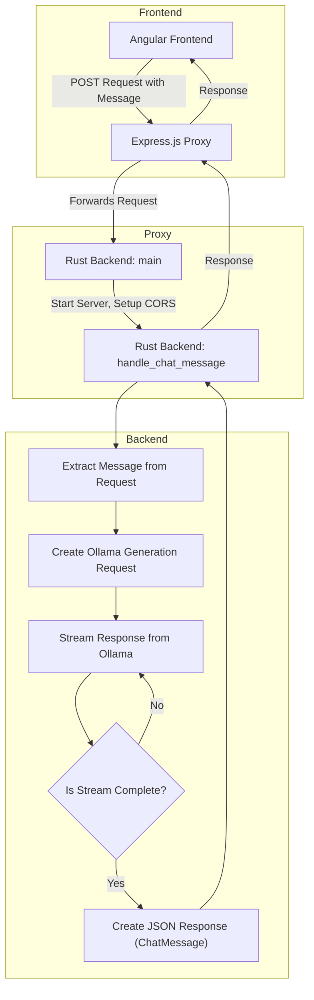

# W/Support: A platform for customer support with an LLM chatbot
[](https://www.rust-lang.org/)
[](https://expressjs.com/)
[](https://angular.io/)

This project, developed in collaboration with Hisense, aims to create an AI-driven support chatbot named SupportSage. SupportSage will utilize a combination of chat interaction and an interactive FAQ system to enhance Hisense's customer support capabilities and reduce the workload on IT support technicians.


## Table of Contents
- [Introduction](#introduction)
- [Project Goals](#project-goals)
- [Technical Overview](#technical-overview)
    - [Architecture](#architecture)
    - [Components](#components)
      * [Frontend (Angular)](#frontend-angular)
      * [Proxy (Express.js)](#proxy-expressjs)
      * [Backend (Rust)](#backend-rust)
- [Local Development](#local-development)
    - [Prerequisites](#prerequisites)
    - [Installation](#installation)
    - [Running the Application](#running-the-application)
    - [Testing](#testing)
- [Contact](#contact)

## Introduction
SupportSage is designed to provide efficient and accurate support to Hisense customers. By leveraging a large language model (LLM) and an interactive FAQ system, the chatbot can understand and respond to user queries, troubleshoot common issues, and guide users to relevant solutions. This will significantly improve the user experience, reduce response times, and free up valuable resources for more complex support issues.


## Project Goals
- **Enhanced Customer Support**: Provide 24/7 availability and faster response times to customer inquiries.
- **Reduced Support Costs**: Lower the workload on IT support staff by automating responses to common questions.
- **Improved User Experience**: Deliver a personalized and intuitive support experience through natural language interactions.
- **Scalability**: Design a system that can easily adapt to increasing user demand and expanding knowledge bases.

## Technical Overview
SupportSage is built using a modern technology stack that combines the strengths of various programming languages and frameworks:

### Architecture
The system follows a microservice architecture, where each component has a distinct responsibility:



### Components
#### [Frontend (Angular)](https://github.com/Hisense-LLM/dashboard)
The Angular frontend is responsible for:
- **User Interface**: Displaying the chat interface, user messages, and chatbot responses.
- **Input Handling**: Capturing user input and sending it to the backend for processing.
- **Response Display**: Rendering the AI-generated responses in the chat window.

#### [Proxy (Express.js)](https://github.com/Hisense-LLM/proxy)
The Express.js proxy serves as the intermediary between the frontend and backend. It handles:
- **Request Routing**: Directing incoming requests to the appropriate backend service.
- **Load Balancing (Optional)**: Distributing requests across multiple backend instances for improved performance.
- **Security**: Implementing security measures like authentication, authorization, and rate limiting.

#### [Backend (Rust)](https://github.com/Hisense-LLM/backend)
The Rust backend is the core of SupportSage, handling the AI interactions. It includes:
- **Message Processing**: Receiving user messages from the proxy, processing them with the Ollama LLM, and generating responses.
- **Error Handling**: Managing errors and exceptions that may occur during processing.
- **CORS Handling**: Enabling cross-origin resource sharing for secure communication with the frontend.

### API Endpoints
- **POST /api/v1/chat**: This endpoint handles incoming chat messages from the frontend and returns the AI generated responses.
    - **URL**: [http://127.0.0.1:8080/api/v1/chat](http://127.0.0.1:8080/api/v1/chat)
    - **Method**: POST
    - **Headers**: Content-Type: application/json
    - **Body**:
      ```json
      {
        "message": "Your message here"
      }
      ```
    - **Response**:
      ```json
      {
        "message": "Your message here",
        "ai_response": "AI's response here"
      }
      ```

## Local Development
### Prerequisites
Ensure you have the following installed on your development machine:
- Node.js and npm/yarn: For running the Express.js proxy.
- Rust Toolchain: Rustup is recommended for installing and managing Rust.
- Ollama: Install and configure Ollama according to their official documentation.

### Installation
1. Clone the frontend and backend repositories
2. Install dependencies


### Running the Application
Start the Rust Backend:
```bash
cd support-sage-backend
cargo run
```

Start the Express.js Proxy:
```bash
cd support-sage-frontend
npm start
# or
yarn start
```

### Testing
You can use tools like Postman to send requests to the `/api/v1/chat` endpoint with different messages and verify that the backend responds correctly. Refer to the Testing with Postman section in the Rust backend README for detailed instructions.

## Contact
For any questions or inquiries, please contact us at our school e-mails!
